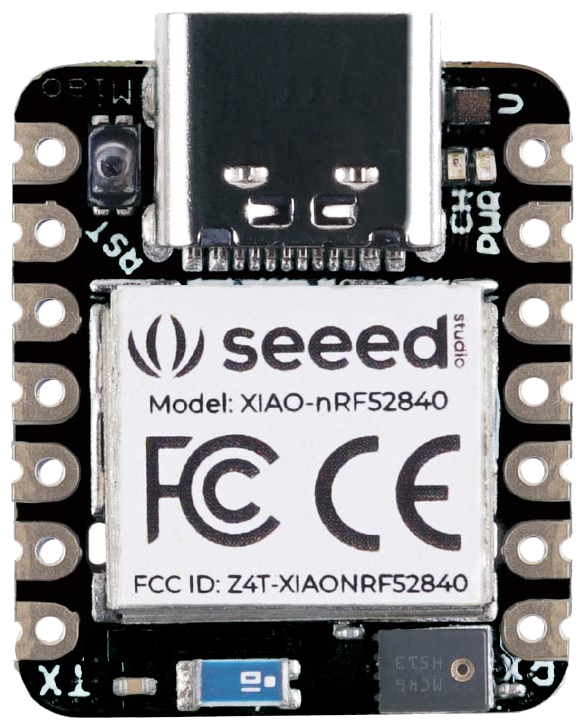

.. _xiao_ble:

XIAO BLE
########

Overview
********

The Seeed XIAO BLE is a tiny (21 mm x 17.5 mm) Nordic Semiconductor nRF52840 ARM
Cortex-M4F development board with onboard LEDs, USB port, QSPI flash, battery
charger, and range of I/O broken out into 14 pins.

Hardware
********

- Nordic nRF52840 Cortex-M4F processor at 64MHz
- 2MB QSPI Flash
- RGB LED
- USB Type-C Connector, nRF52840 acting as USB device
- Battery charger BQ25101
- Reset button
- Bluetooth antenna

Supported Features
==================

The xiao_ble board configuration supports the following hardware features:

+-----------+------------+----------------------+
| Interface | Controller | Driver/Component     |
+===========+============+======================+
| ADC       | on-chip    | adc                  |
+-----------+------------+----------------------+
| CLOCK     | on-chip    | clock_control        |
+-----------+------------+----------------------+
| FLASH     | on-chip    | flash, QSPI flash    |
+-----------+------------+----------------------+
| GPIO      | on-chip    | gpio                 |
+-----------+------------+----------------------+
| I2C(M)    | on-chip    | i2c                  |
+-----------+------------+----------------------+
| MPU       | on-chip    | arch/arm             |
+-----------+------------+----------------------+
| NVIC      | on-chip    | arch/arm             |
+-----------+------------+----------------------+
| PWM       | on-chip    | pwm                  |
+-----------+------------+----------------------+
| RADIO     | on-chip    | Bluetooth,           |
|           |            | ieee802154           |
+-----------+------------+----------------------+
| RTC       | on-chip    | system clock         |
+-----------+------------+----------------------+
| SPI(M/S)  | on-chip    | spi                  |
+-----------+------------+----------------------+
| UART      | on-chip    | serial               |
+-----------+------------+----------------------+
| USB       | on-chip    | usb                  |
+-----------+------------+----------------------+
| WDT       | on-chip    | watchdog             |
+-----------+------------+----------------------+

Other hardware features have not been enabled yet for this board.

Connections and IOs
===================

The `XIAO BLE wiki`_ has detailed information about the board including
`pinouts`_ and the `schematic`_.

LED
---

* LED1 (red) = P0.26
* LED2 (green) = P0.30
* LED3 (blue) = P0.06

Programming and Debugging
*************************

The XIAO BLE ships with a bootloader. However, this guide doesn't describe how
to use it and instead an External Debug Probe is used in order to program the
board. If you have one, you can also use an external :ref:`debug probe
<debug-probes>` to flash and debug Zephyr applications, but you need to solder
an SWD header onto the back side of the board.

For Segger J-Link debug probes, follow the instructions in the
:ref:`jlink-external-debug-probe` page to install and configure all the
necessary software.

Flashing
========

Follow the instructions in the :ref:`jlink-external-debug-probe` page to install
and configure all the necessary software. Then build and flash applications as
usual (see :ref:`build_an_application` and :ref:`application_run` for more
details).

Here is an example for the :ref:`hello_world` application.

First, run your favorite terminal program to listen for output.

.. code-block:: console

   $ minicom -D <tty_device> -b 115200

Replace :code:`<tty_device>` with the port where the board XIAO BLE
can be found. For example, under Linux, :code:`/dev/ttyACM0`.

Then build and flash the application in the usual way. Just add
``CONFIG_BOOT_DELAY=5000`` to the configuration, so that USB CDC ACM is
initialized before any text is printed, as below:

.. zephyr-app-commands::
   :zephyr-app: samples/hello_world
   :board: xiao_ble
   :goals: build flash
   :gen-args: -DCONFIG_BOOT_DELAY=5000

Debugging
=========

Refer to the :ref:`jlink-external-debug-probe` page to learn about debugging
boards with a Segger IC.

Testing the LEDs in the XIAO BLE
********************************

There is a sample that allows to test that LEDs on the board are working
properly with Zephyr:

.. zephyr-app-commands::
   :zephyr-app: samples/basic/blinky
   :board: xiao_ble
   :goals: build flash

You can build and flash the examples to make sure Zephyr is running correctly on
your board. The LED definitions can be found in
:zephyr_file:`boards/arm/xiao_ble/xiao_ble.dts`.

Testing shell over USB in the XIAO BLE
**************************************

There is a sample that allows to test shell interface over USB CDC ACM interface
with Zephyr:

.. zephyr-app-commands::
   :zephyr-app: samples/subsys/shell/shell_module
   :board: xiao_ble
   :goals: build flash

References
**********

.. target-notes::

.. _XIAO BLE wiki: https://wiki.seeedstudio.com/XIAO_BLE/
.. _pinouts: https://wiki.seeedstudio.com/XIAO_BLE/#hardware-overview
.. _schematic: https://wiki.seeedstudio.com/XIAO_BLE/#resources
